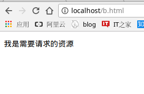
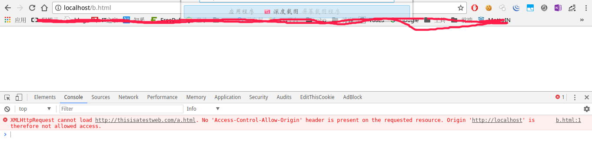
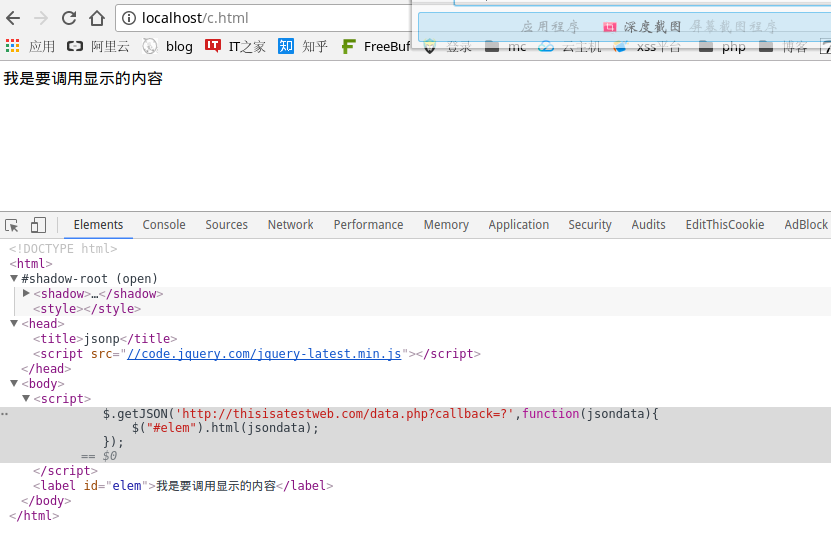

# js跨域问题研究

## 一些基础的东西

### 什么是浏览器同源策略(SOP)
同源，是指域名(二级域名是否相同)，协议(http/https)，端口(80/8080)相同。若有一个不同，浏览器就会认为js所请求的资源是不同的源（域），随后便会在控制台报错，并且屏蔽掉js所请求到的信息。

### 什么是跨域
即，js获取非同源的内容。称为跨域（个人理解）。

## 什么情况下会发生跨域
当客户端脚本(js)利用XMLHttpRequest对象去请求资源时，浏览器处于安全考虑，只允许其请求当前页面同一域里的url，此时若想直接调用远程服务器，则需要跨域。  
举例来说明：  
a.html
```html
<p>我是需要请求的资源</p>
```
b.html
```html
<!DOCTYPE html>
<html>
        <head>
                <title>js test</title>
                <script src="http://code.jquery.com/jquery-latest.min.js"></script>
        </head>
        <body>
                <script>
                $(function(){
                        $("#elem").load("http://localhost/a.html");
                });
                </script>
                <label id="elem"></label>
        </body>
</html>
```
当浏览器去访问http://localhost/b.html时，可以请求到a.html的内容。  
如图  
  
在/etc/hosts文件加一个记录  
```
127.0.0.1   thisisatestweb.com  thisisatestweb
```
此时浏览器访问thisisatestweb.com实际访问的就是本地的localhost，然后我们把b.html文件中的http://localhost替换为http://thisisatestweb.com/a.html。此时便会触发到浏览器的安全策略。  
如图  
  

## 如何实现跨域

+ jsonp
+ websocket
+ document.domain
+ window.name
+ cors
+ window.postMessage

### jsonp
浏览器会对js的跨域请求进行限制，但对于`<script>`标签的请求没有限制，jsonp就是利用此原理，动态的添加`<script>`标签，实现跨域。  
c.html  
```html
<!DOCTYPE html>
<html>
	<head>
		<title>jsonp</title>
		<script src="//code.jquery.com/jquery-latest.min.js"></script>
	</head>
	<body>
	<script>
		$.getJSON('http://thisisatestweb.com/data.php?callback=?',function(jsondata){
			$("#elem").html(jsondata);	
		});
	</script>
	<label id='elem'></label>
	</body>
</html>
```
data.php  
```php
<?php 
$callback = $_GET['callback'];
$data = '我是要调用显示的内容';
echo $callback.'('.json_encode($data).')';
```
浏览器访问localhost/c.html,如图：  
  

### document.domain
